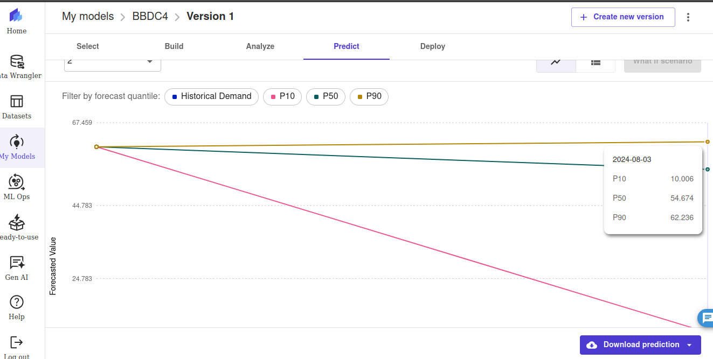
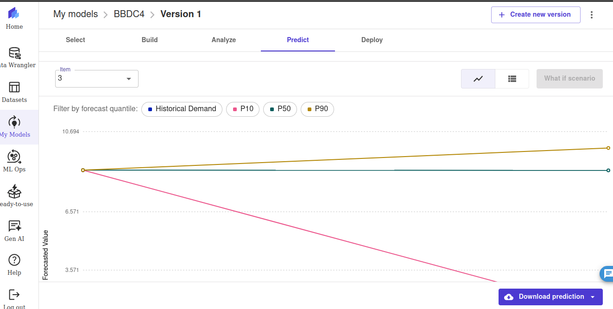
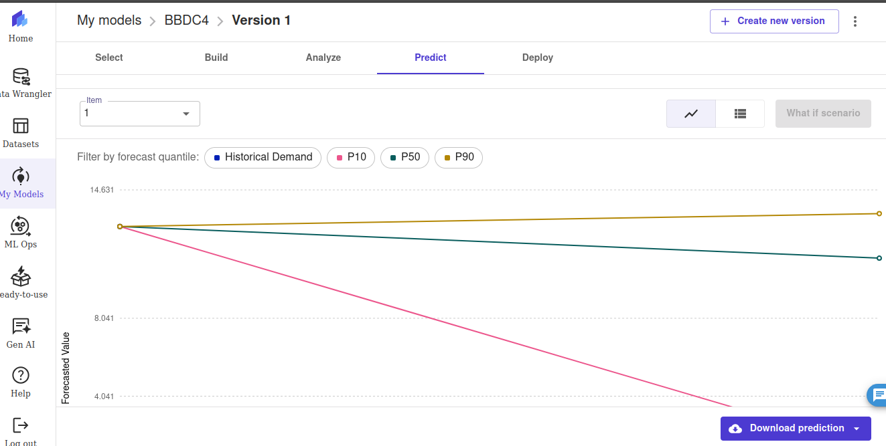

# 📊 Previsão de cotações na bolsa de valores Inteligente na AWS com [SageMaker Canvas](https://aws.amazon.com/pt/sagemaker/canvas/)

Bem-vindo ao projeto "Previsão de cotações na bolsa de valores Inteligente na AWS com SageMaker Canvas. Siga os passos abaixo para realizar a predição da bolsa de valores!

## 📋 Faça você também!
Use o arquivo dataset_mercado_financeiro.py em Python para baixar dados históricos de ações de uma determinada ticker usando a biblioteca yfinance. O programa obtém dados diários de 365 dias e os salva em um arquivo CSV. Os dados retornados possuem as seguintes colunas: Date, Open, High, Low, Close, Volume, Dividends, Stock Splits

Necessário:
    Python 3.8 > instalado em seu sistema.
    Biblioteca yfinance instalada.

Se preferir, instale as dependências necessárias usando o arquivo requirements.txt:

Treine utilizando o SageMaker Canvas.

## 🚀 Exemplo e análise de modelo preditivo para os ticker's VALE3.SA, ALPA4.SA  e BBDC4.SA (Vale, Alpargatas e Banco Bradesco)

### 1. Limpeza do dataset

Como é conhecido, não houve splits em nenhuma das empresas neste último ano. Desta maneida, esta coluna foi eliminada do dataset, visando a geração de um melhor modelo mais clean. 

Também foi necessário alterar os nomes de algumas colunas, como por exemplo Open, Close, dentre outros devido ao fato destas palavras serem reservadas pelo sistema.

Não havia nenhuma coluna incompleta, logo não foi necessário tratar isso.

### 2. Model overview

Foi utilizado o Time series forecasting e como target a coluna High (cotação máxima da ação no dia) e, como time stamp, a coluna Date. 

A opção de holiday foi utilizada, já que é conhecido pelo mercado que exite alteração no volume de movimentações na bolsa de valores nos dias de feriado, possivelmente alterando o valor da cotação, já que com a maior eu menor demanda o preço é naturalmente alterado.

Para um primeiro teste foi utilizado o quick build.

### 3. Analises

-   A perda média ponderada de quantis (wQL) avalia a previsão como um todo calculando a média da precisão em pontos de distribuição específicos chamados quantis para os quantis P10, P50 e P90. Um valor mais baixo indica um modelo mais preciso.

    R = 0.127

-   O erro percentual médio absoluto (MAPE) é o erro percentual (diferença percentual entre o valor médio previsto e o valor real) calculado em média em todos os pontos de tempo. Um valor menor indica um modelo mais preciso com MAPE=0 como um modelo perfeito e sem erros.

    R = 0.106

-   O erro percentual absoluto ponderado (WAPE) mede o desvio geral dos valores previstos em relação aos valores observados e é definido pela soma do erro absoluto normalizado pela soma da meta absoluta. Um valor mais baixo indica um modelo mais preciso com WAPE=0 como um modelo perfeito e sem erros.
    
    R = 0.168

-   Root Mean Square Error (RMSE) é a raiz quadrada dos erros quadráticos médios. Um RMSE mais baixo indica um modelo mais preciso com RMSE=0 como um modelo perfeito e sem erros.

    R = 7.225

-   Erro Médio Absoluto em Escala (MASE) é a média do erro absoluto da previsão normalizada pelo erro médio absoluto de um método simples de previsão de linha de base. Um valor mais baixo indica um modelo mais preciso com MASE < 1 como um modelo estimado como melhor que a linha de base e um MASE > 1 como um modelo estimado como pior que a linha de base.

    R = 0.292

-   Impacto das colunas

    Holiday_BR 31.68%

    Close 13.87%

    Volume 8.72%

    Open 6.04%

    Low 4.67%

    Dividendos 0.11%

### 4. Previção das cotações

-   VALE3.SA
    
    P90 = R$62.236

    P50 = R$54.674

    P10 = R$10.006

    

Podemos observar que o valor P10 está muito abaixo da normalidade, logo faz se necessário uma melhora do modelo. O valor P90 e P50 parecem ser corretos, principalmente pela análise dos novos dividendos de VALE3 

-   ALPA4.SA

    P90 = R$9.851

    P50 = R$8.7

    P10 = R$1.41

Novamente o valor P10 está muito abaixo da normalidade, P90 e P50 demonstram uma previsão negativa para a ação, o que parece coerente com o mercado atual.

-   BBDC4.SA

    P90 = R$13.416

    P50 = R$11.13

    P10 = R$1.257

    

Aqui também o P10 está muito abaixo, P90 mostra uma predição positiva e coerente com o mercado.
